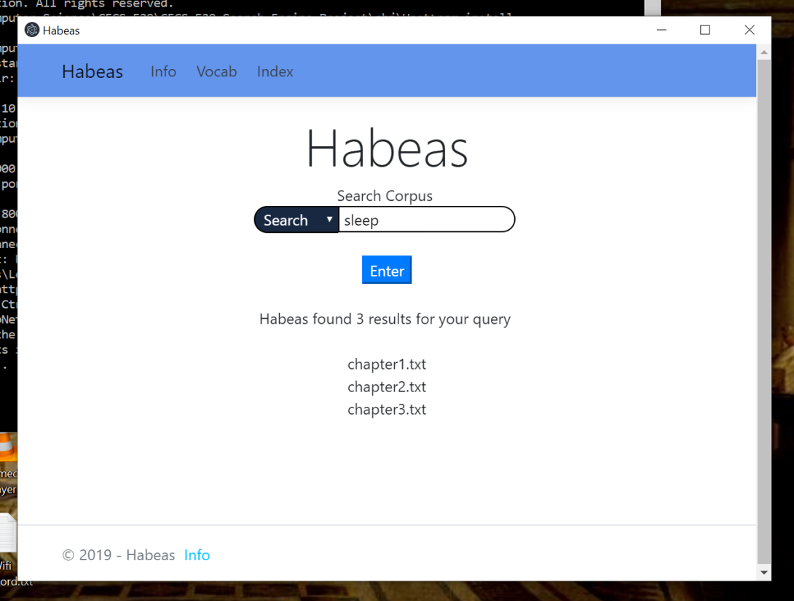

<!-- Readme Start here -->

<!-- Load logo from readme/logo.jpg -->

  

<!-- Title -->
<h1 align="center" style="border: none">
Habeas
</h1>

<!-- Shield IO - very nice icons -->

[![Contributors][contributors_shield]][contributors_url]
[![Forks][forks_shield]][forks_url]
[![Stargazers][stars_shield]][stars_url]
[![Issues][issues_shield]][issues_url]
[![MIT License][license_shield]][license_url]
[![LinkedIn][linkedin_shield]][linkedin_url]

<!-- Description -->
A complete implementation of large scale search engine including on-disk indexing, multiple queries options, and user interfaces.

## Features
- [Core]
  - Corpus to handle Json
  - Building positional index
  - Indexing and Tokenization
  - Query Language
  - Main Application
  - JsonFileDocument
- [Extra]
  - Unit Testing
  - GUI
  - Wildcard Queries
  - SoundEx
  - Near Operator
- [Features Details]

<!-- Include your major tools and frameworks -->
## Built With
- [C#]
- [Electron.NET]

<!-- Collaborators information -->
## Collaborators
- [Sotheanith Sok]
- [Yashua Ovando]
- [Jesse Blacklock]
- [Sella Bae]

## Course
- [CECS 529 - Search Engine Technology]

<!-- License -->
## License
This project is licensed under the MIT License - see the [LICENSE.md][license_url] file for details

<!-- Shoutout to other projects, plugin, or minor tools -->
## Acknowledgments
Special thank to
- [Best-README-Template] - the readme template.

<!-- References -->
<!-- Shield Icons-->
[contributors_shield]: https://img.shields.io/github/contributors/sotheanithsok/Habeas.svg?style=for-the-badge
[forks_shield]: https://img.shields.io/github/forks/sotheanithsok/Habeas.svg?style=for-the-badge
[stars_shield]: https://img.shields.io/github/stars/sotheanithsok/Habeas.svg?style=for-the-badge
[issues_shield]: https://img.shields.io/github/issues/sotheanithsok/Habeas.svg?style=for-the-badge
[license_shield]: https://img.shields.io/github/license/sotheanithsok/Habeas.svg?style=for-the-badge
[linkedin_shield]: https://img.shields.io/badge/-LinkedIn-black.svg?style=for-the-badge&logo=linkedin&colorB=555

<!-- Shield URLs -->
[contributors_url]: https://github.com/sotheanithsok/Habeas/graphs/contributors
[forks_url]: https://github.com/sotheanithsok/Habeas/network/members
[stars_url]: https://github.com/sotheanithsok/Habeas/stargazers
[issues_url]: https://github.com/sotheanithsok/Habeas/issues
[license_url]: https://github.com/sotheanithsok/Habeas/blob/master/LICENSE
[linkedin_url]: https://www.linkedin.com/in/sotheanith-sok-969ab0b3/

<!-- Other links -->
[Sotheanith Sok]: https://github.com/sotheanithsok
[Best-README-Template]: https://github.com/othneildrew/Best-README-Template
[Core]: https://github.com/sotheanithsok/Habeas/blob/master/docs/milestone1-summary.md#core-modules
[Extra]: https://github.com/sotheanithsok/Habeas/blob/master/docs/milestone1-summary.md#additional-features
[C#]: https://docs.microsoft.com/en-us/dotnet/csharp/
[Electron.NET]: https://github.com/ElectronNET/Electron.NET
[Yashua Ovando]: https://github.com/ydovando
[Jesse Blacklock]: https://github.com/jblacklock
[Sella Bae]: https://github.com/sellabae
[CECS 529 - Search Engine Technology]: http://catalog.csulb.edu/preview_course_nopop.php?catoid=5&coid=40030

