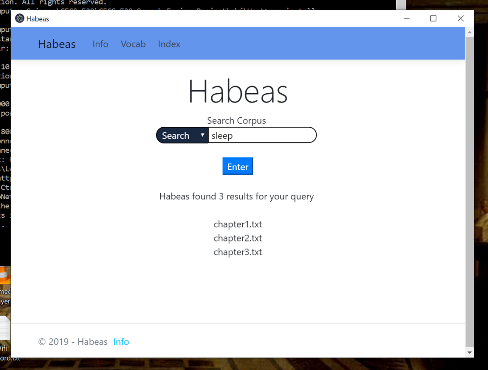
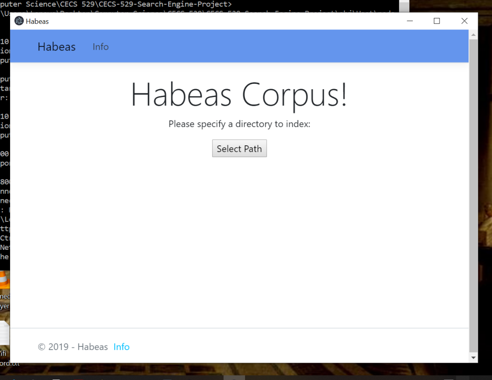
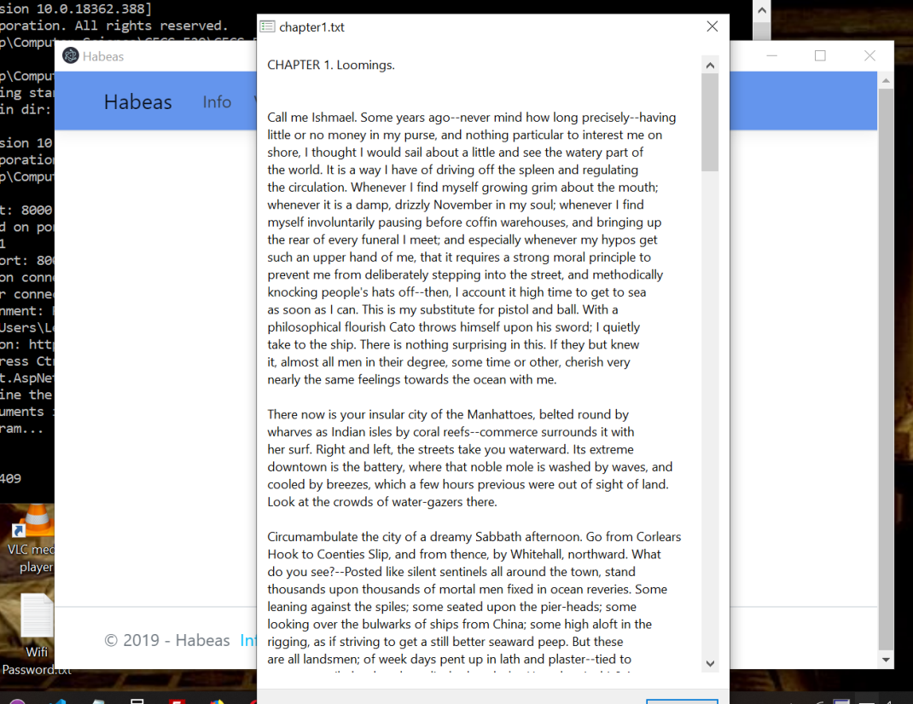

# Habeas v1.3
CECS-529-Search-Engine-Project  
A semester long project implementing search engine

# Milestone 1

[Milestone 1 Requirements](docs/milestone1-summary.md)

## Supported features
### Search Queries
- Single query `ants`
- Phrase query `"dancing ants"`
- Or query `dance + ants`
- And query `dance ants`
- Near query `[dance near/2 ants]`
- Wildcard query `danc*`
- Author query `:author name`
### Special Queries
- **Index** another corpus
- **Stem** a term
- Print **vocabulary** of the index

## Design
### Index
**Positional-Inverted-Index**  
`term -> (docId, [pos1, pos2, ...]), (docId, [...]), ...`  
A posting stores document id and positions of a term within a document
### Token Processor
- lowercase
- removes `-`, `'`, `"`, non-alphanumerics
- stem (e.g. dancing, dances -> dance)

## GUI
- using Electron.Net
- more screenshots  

